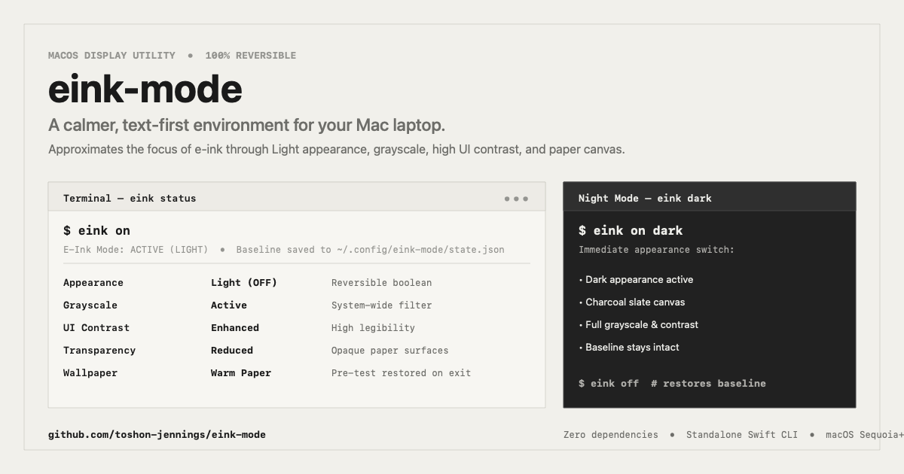

# E-Ink Mode for macOS

<p align="center">
  
</p>

A small Swift CLI that requests a lighter, grayscale, lower-motion macOS appearance and a plain paper background. It approximates an e-ink workflow; it does not alter the display hardware. `on` records the current settings and `off` attempts to restore them. This is a prototype, not a guarantee of complete restoration in every failure case.

---

## Setting Control & Feasibility Matrix (tested on macOS 26.6.2)

| Setting | Mechanism | Classification | Restoration limits |
|---|---|---|---|
| **Light Appearance** | System Events AppleScript | **Automation permission may be needed** | The previous boolean is recorded. AppleScript can fail, and the fallback read may not reflect the system-wide preference. |
| **Grayscale, Increase Contrast, Reduce Transparency, Differentiate Without Color** | Dynamically loaded `UniversalAccess.framework` functions | **Private macOS interfaces** | These worked in Gemini's test on this Mac. Apple does not guarantee these functions across macOS updates; the setters do not report success. |
| **Reduce Motion** | `com.apple.Accessibility` preference write and Darwin notification | **Undocumented integration** | The preference is recorded and written back on `off`, but currently running apps may not all update immediately. |
| **Wallpaper** | Public AppKit `NSWorkspace` desktop-image API | **Per connected screen, current Space** | `on` captures each screen's reported image URL and scaling/clipping/fill options before applying `assets/eink_paper.png`. If any screen cannot be captured, wallpaper is left unchanged. `off` restores and reads back the saved values; a failure leaves the ledger active for retry. Other Spaces and dynamic-wallpaper behavior are not covered by this snapshot. |

The CLI does **not** invoke Shortcuts accessibility intents. The optional Shortcuts described below only launch the CLI; they do not grant it extra privileges or guarantee that a private setting will apply.

---

## Installation

### Option 1: Homebrew (Recommended)

Install directly via tap:

```bash
brew install toshon-jennings/tap/eink
```

### Option 2: Pre-compiled GitHub Release Binary

Download the universal macOS binary (`x86_64` + `arm64`) from the [Latest GitHub Release (v0.1.0)](https://github.com/toshon-jennings/eink-mode/releases/latest):

```bash
curl -LO https://github.com/toshon-jennings/eink-mode/releases/download/v0.1.0/eink-v0.1.0-macos.tar.gz
```

```bash
tar -xzf eink-v0.1.0-macos.tar.gz
```

```bash
sudo mv eink-v0.1.0/eink /usr/local/bin/
```

### Option 3: Build from Source

```bash
git clone https://github.com/toshon-jennings/eink-mode.git
```

```bash
cd eink-mode && make all
```

---

## Quick Start

If installed via Homebrew or in your `PATH`, invoke `eink` directly. If using the local build in this repo, use `~/eink-mode/bin/eink`.

### 1. Check Current Status
```bash
eink status
```

To check whether wallpaper capture is available without changing anything:
```bash
eink wallpaper-check
```

### 2. Turn On E-Ink Mode (Light or Dark)
```bash
eink on
```
Or choose your appearance mode directly upon activation:
```bash
eink on dark
```
```bash
eink on light
```
- Records the reported appearance, display-filter, motion, and current-Space wallpaper settings in `~/.config/eink-mode/state.json` before requesting changes.
- In **Light mode** (default): sets Light appearance and warm e-ink paper wallpaper (`eink_paper.png`).
- In **Dark mode**: sets Dark appearance and matte dark slate wallpaper (`eink_dark_paper.png`).
- Requests grayscale, increased contrast, reduced transparency, differentiation without color, and reduced motion.
- If every connected screen's wallpaper is captured, applies the appropriate paper image to those screens. If preflight fails, leaves wallpaper unchanged and reports why.

### 3. Change Appearance Mode Immediately While Active
You can toggle between Dark and Light appearance instantly at any time without leaving E-Ink Mode or clobbering your original baseline:
```bash
eink on dark
```
```bash
eink on light
```
Or use the direct shorthands:
```bash
eink dark
```
```bash
eink light
```
This immediately updates the macOS appearance and switches between the light paper and dark slate wallpapers, while keeping your pre-E-Ink baseline intact.

### 4. Turn Off E-Ink Mode (Restore Baseline)
```bash
eink off
```
- Requests restoration of the recorded appearance, accessibility settings, and current-Space wallpapers.
- Reads back the reported settings and wallpaper URLs/options for connected screens. If restoration cannot be verified, keeps the ledger active so `eink recover` can retry.

### Wallpaper boundary

Apple's documented API addresses a screen's current desktop image, not an inventory of every desktop Space. This mode captures the wallpaper visible on each connected screen when `on` runs. It cannot promise that a different Space, a disconnected display, a dynamic wallpaper's timing behavior, or the "Show on all Spaces" setting will be restored. If you use different wallpapers on multiple Spaces, test this mode on a non-critical Space before relying on it. Do not switch Spaces or disconnect a screen during the first on/off test. A Settings color preset and the included solid PNG have the same state-restoration issue; using Apple's preset would not remove this boundary.

### 5. Optional: Add to Shell PATH
Add the binary to your `~/.zshrc` for direct invocation:
```bash
export PATH="$HOME/eink-mode/bin:$PATH"
```

---

## State Ledger & Reversibility Limits

State is serialized in `~/.config/eink-mode/state.json`:

```json
{
  "active": true,
  "timestamp": "2026-09-19T12:43:41Z",
  "baseline": {
    "darkMode": true,
    "grayscale": false,
    "increaseContrast": false,
    "reduceTransparency": false,
    "differentiateWithoutColor": false,
    "reduceMotion": false
  },
  "wallpapers": [
    {
      "displayID": 1,
      "imageURL": "file:///path/to/original.heic",
      "imageScaling": 3,
      "allowClipping": true,
      "fillColorArchive": "<archived color data>"
    }
  ]
}
```

The example is illustrative; the real ledger contains this Mac's actual values.

- **Repeated `on`**: If a readable active ledger exists, a second `on` preserves its baseline.
- **State write**: The ledger is written atomically and decoded back before settings are changed. This protects against a failed write, but not every possible crash or external edit.
- **Partial failure**: Some private setters return no result. `off` compares reported values afterward and keeps the ledger active on a mismatch. Readback still cannot prove that every app has visually updated.
- **Older ledgers**: If an older version recorded a single wallpaper path, `off` still attempts that legacy restoration. New activations use the per-screen snapshot above.

---

## Recovery Paths (If Settings Ever Get Stuck)

If you ever find your display settings stuck or need an emergency reset:

1. **CLI Recovery**:
   ```bash
   eink recover
   ```
   If no active ledger exists, `--force` turns off the controlled accessibility settings; **it does not restore your previous preferences** and may overwrite accessibility choices you made yourself:
   ```bash
   eink recover --force
   ```

2. **macOS Hardware Shortcut**:
   Press **`Option + Command + F5`** (or triple-click Touch ID) to open the macOS Accessibility Shortcuts HUD and uncheck *Color Filters* or *Increase Contrast* instantly.

3. **System Settings GUI**:
   - Open **System Settings > Accessibility > Display**.
   - Toggle **Color Filters** (Grayscale) or **Increase Contrast** off.
   - Open **System Settings > Appearance** to switch back to Dark mode.

---

## Optional: Apple Shortcuts Companion

If you prefer a menu bar icon, Touch Bar button, or global hotkey:

1. Open **Shortcuts.app** on your Mac.
2. Create a new Shortcut named **"E-Ink Mode"**.
3. Add the **Run Shell Script** action:
   ```bash
   /Users/toshonjennings/eink-mode/bin/eink on
   ```
4. Create a companion Shortcut named **"Standard Mode"**:
   ```bash
   /Users/toshonjennings/eink-mode/bin/eink off
   ```
5. Check **Use as Quick Action** or **Pin in Menu Bar** in Shortcut details.
